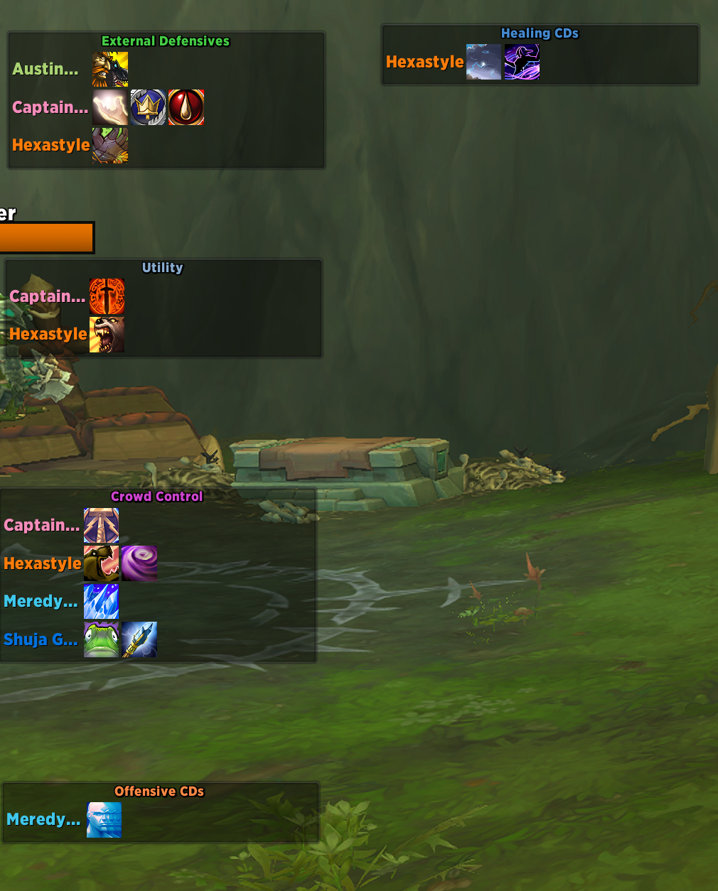
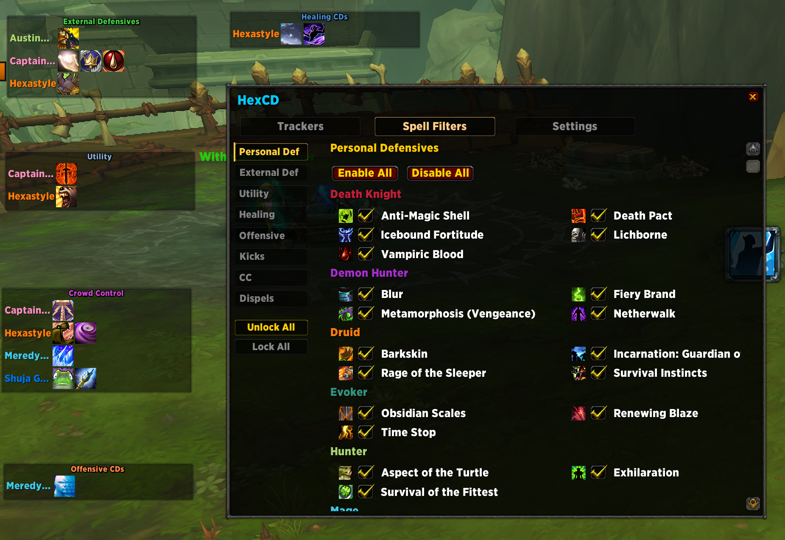
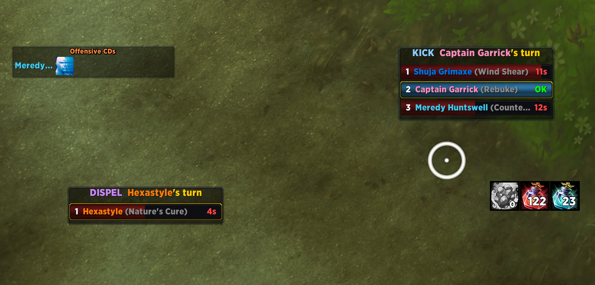

# HexCD

A cooldown tracker for WoW Midnight that works with the new addon restrictions.

## What it shows you

- **Personal defensives** anchored to each party member's unit frame — see who's got Barkskin, Diffuse Magic, etc. up at a glance.
- **Floating bars grouped by purpose** — Healing CDs, External Defensives, Offensive bursts, CC, Utility.
- **Kick rotation** — auto-enrolls your party's interrupters sorted by cooldown, shows who's up next.
- **Dispel rotation** — same deal for your healers, with TTS alerts when a debuff lands.
- **CC tracker** — live cooldowns when they're pressed.

## Screenshots

## Config

Type `/hexcd` in-game to open the GUI. Everything — tracker toggles, spell filters, frame positions — lives there. No slash-command soup.

## Install

Available on Wago: https://wago.io/rNkyYlKa
